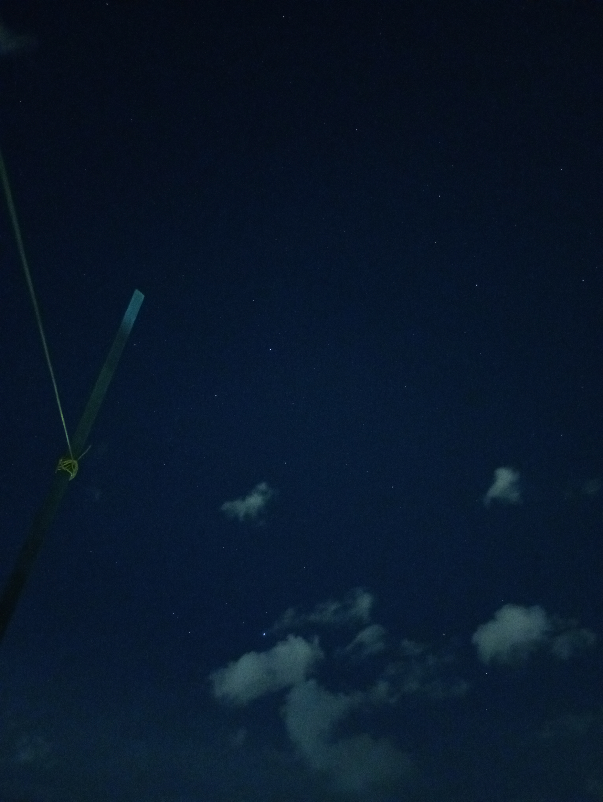
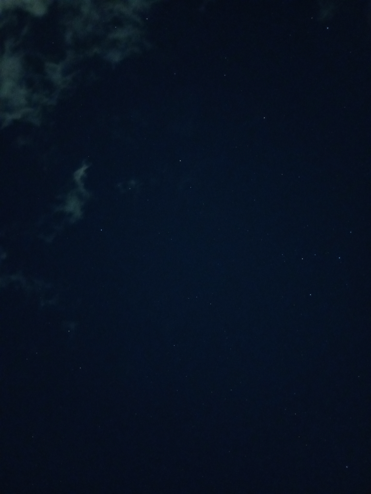
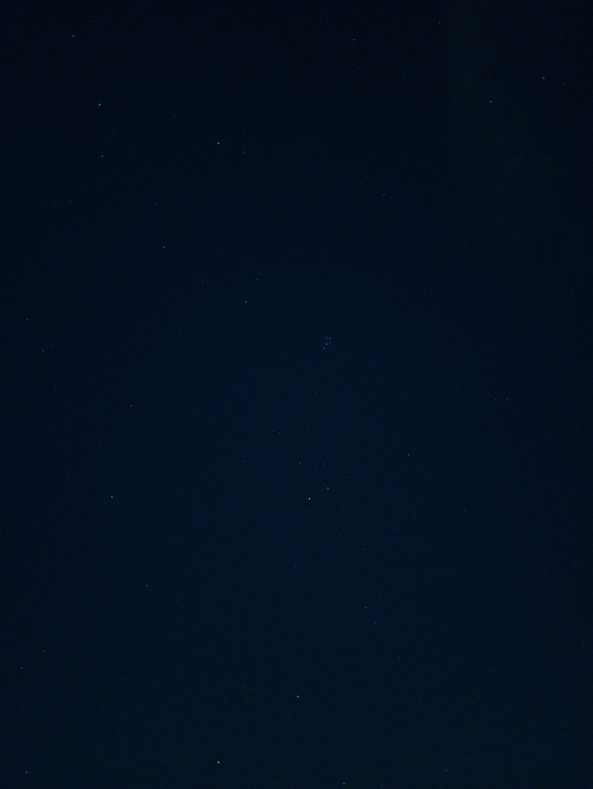
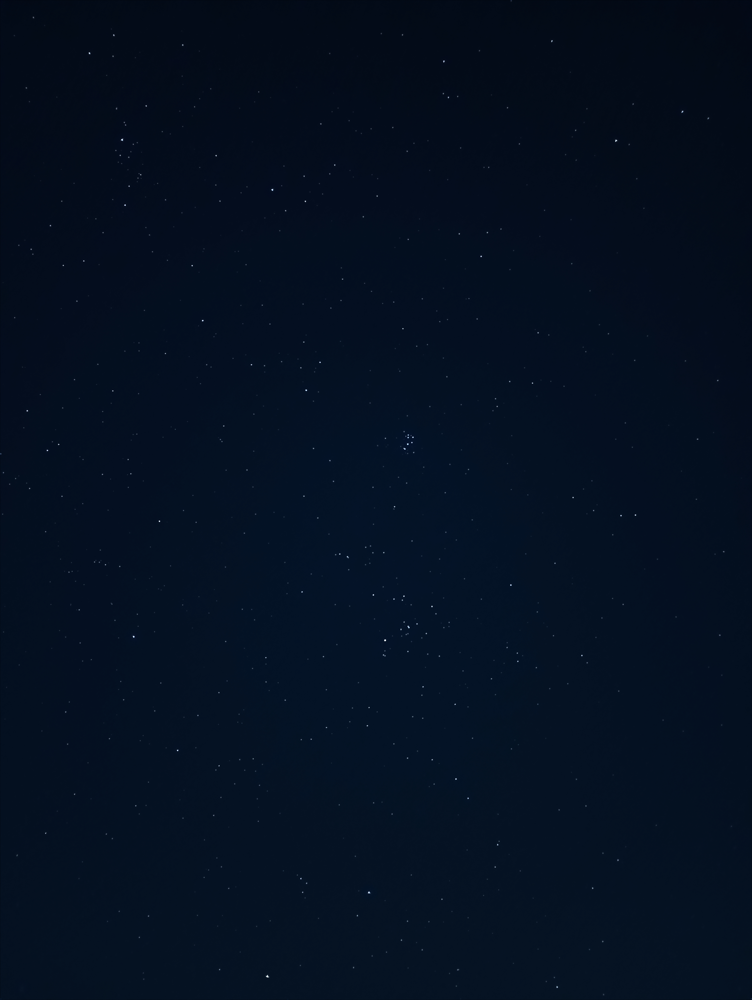

# Smartphone Astrophotography Processing Pipeline

This repository documents my end-to-end workflow for processing night sky images captured with a smartphone. The pipeline combines image stacking, a custom Python-based enhancement script, and final manual editing using open-source tools to produce clean, detailed star images.

---

## Overview of the Workflow

1. Capture multiple star images using a smartphone
2. Stack images using DeepSkyStacker → `Autosave.tif`
3. Enhance stars and background using `AstroStakos.py` → `final_star_enhanced_rgb16.tif`
4. Perform final adjustments and export using GIMP 3

Each step is designed to preserve faint stars, avoid harsh artifacts, and maintain natural star shapes and colors.

---

## 1. Image Capture (Input)

* Images are captured using a smartphone mounted on a tripod.
* Multiple exposures of the same star field are taken.
* The goal is to increase signal-to-noise ratio through stacking rather than heavy single-frame processing.

---

## 2. Image Stacking with DeepSkyStacker

* **DeepSkyStacker (DSS)** is used to:

  * Align individual frames
  * Stack them to reduce noise
  * Preserve faint star detail
* The stacked output is saved as a **linear, 16-bit TIFF**.

**Required output filename:**

```
Autosave.tif
```

This file is the sole input for the Python processing stage.

---

## 3. Star Enhancement with `AstroStakos.py`

`AstroStakos.py` is a custom Python script that performs background extraction, star detection, adaptive star enhancement, and contrast stretching on the stacked image.

### 3.1 Input Requirements

* File name: `Autosave.tif`
* Format:

  * 16-bit TIFF
  * Linear (not stretched)
* Color:

  * RGB preferred
  * Grayscale supported (converted to RGB automatically)

---

### 3.2 Running the Script

From a terminal:

```bash
python AstroStakos.py
```

After launching, the script opens a **file selection window** that allows you to choose the stacked TIFF file.

#### File Selection

* A graphical dialog appears prompting you to select a `.tif` file.
* Select the **stacked output from DeepSkyStacker** (typically `Autosave.tif`).
* Only TIFF files are accepted.

The script will:

* Load the selected TIFF at full precision
* Validate format and bit depth
* Automatically proceed with processing

If no file is selected, or if the file is invalid, execution stops with an error message.

---

### Notes

* The file **does not need to be named `Autosave.tif`**, but it must be:

  * A 16-bit TIFF
  * Linear (not stretched)
* RGB is preferred, but grayscale files are supported and converted automatically.

---

### 3.3 Processing Stages in `AstroStakos.py`

#### a. Image Loading and Normalization

* Loads the TIFF at full precision.
* Detects RGB vs grayscale input.
* Normalizes pixel values to floating point (`0.0 – 1.0`) for processing.

---

#### b. Luminance-Based Star Detection

* A luminance channel is computed from RGB data.
* Stars are detected using **high-pass filtering**:

  * Small Gaussian blur minus large Gaussian blur
* A statistical threshold distinguishes stars from background noise.
* A **soft star mask** is created using dilation and Gaussian smoothing.

The star mask is computed **once** and reused for all color channels to prevent color misalignment.

---

#### c. Background Modeling with Overlapping Tiles

* The image is divided into large, overlapping tiles.
* Each tile:

  * Models the background using Gaussian smoothing
  * Uses cosine-based blending at edges
* Overlapping regions are blended smoothly into a single background model.

This approach avoids:

* Tile seams
* Gradient banding
* Over-subtraction artifacts

---

#### d. Star and Background Separation

For each color channel:

* The background model is subtracted.
* Star signal is extracted using the soft star mask.
* This produces:

  * A background
  * A star map
  * A starless image

Separating stars from the background allows targeted enhancement without damaging the sky background.

---

#### e. Adaptive Star Enhancement

* Star brightness is enhanced using a **luminosity-aware approach**:

  * Dim stars receive a stronger boost
  * Bright stars are enhanced conservatively
* Color ratios are preserved to maintain realistic star colors.
* This avoids blown highlights while improving faint star visibility.

---

#### f. Contrast Stretching

* An **arcsinh (asinh) stretch** is applied.
* This stretch is commonly used in astrophotography because it:

  * Enhances faint details
  * Preserves bright star cores
* Stretch strength is configurable in the script.

---

#### g. Mild Sharpening

* A light sharpening pass improves star definition.
* Parameters are intentionally conservative to avoid halos or ringing.

---

### 3.4 Script Output

The script produces a single output file:

```
final_star_enhanced_rgb16.tif
```

**Output characteristics:**

* 16-bit per channel
* RGB
* Enhanced and stretched
* Suitable for final editing

No JPEG is generated at this stage by design.

---

## 4. Final Editing and Export (GIMP 3)

* The enhanced TIFF is opened in **GIMP 3**.
* Optional final adjustments:

  * Curves / levels
  * Color balance
  * Cropping or rotation
* The final image is exported as a JPEG for sharing or publishing.

**Final output:**

```
final_image.jpg
```

---

## Design Goals

This pipeline is optimized for **smartphone astrophotography**, where:

* Noise levels are relatively high
* Stars are small and easily distorted
* Faint detail is easily lost

Key goals:

* Preserve circular star shapes
* Enhance faint stars without blowing out bright ones
* Avoid harsh background subtraction artifacts
* Maintain accurate color balance

---

## Summary

**Complete pipeline:**

1. Capture star images on a phone
2. Stack images in DeepSkyStacker → `Autosave.tif`
3. Process with `AstroStakos.py` → `final_star_enhanced_rgb16.tif`
4. Export final JPEG using GIMP 3

> Below are example images processed from data captured at my residence within the city of Patras, demonstrating the pipeline’s performance under typical urban light-pollution conditions.

---
| Raw image |  Final |
|-----------|---------|-------|
|  |  |
|  |  |
|  |  |
